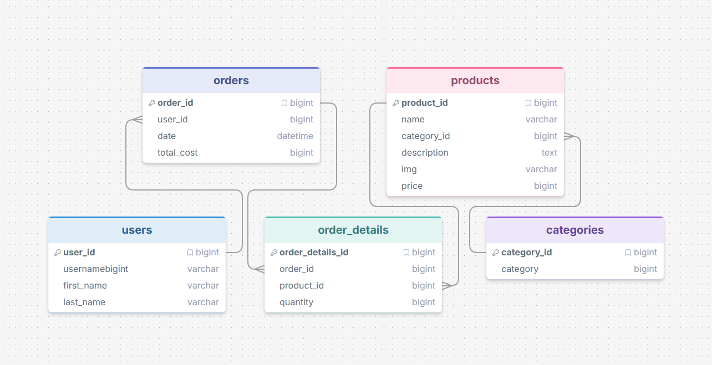

# AK Consulting Group

## Collaborators

- Kelley Castillo — GitHub: kacastillo
- Kate Nguyen — GitHub: meomeodestroyer
- Adam Kurfurst — GitHub: akurfurst

**AK Office Supplies Retailer**\
Web Frameworks Capstone Project

---

## Project Overview

AK Office Supplies is a professional e-commerce application focused on supplying businesses, education, and industrial companies with high-quality office supplies. The purpose of this project is to demonstrate full-stack web application architecture using:

- Server-Side Rendering (SSR)
- Express.js
- MVC architecture
- MySQL database integration
- REST-style API endpoints
- Secure session-based state management

This project serves as a portfolio-ready example of structured, maintainable web application development.

---

## Architecture (MVC)

Every request flows through a clean, layered MVC structure. No SQL lives in routes, and no database calls live in views.

```
Route  →  Controller  →  Service  →  Data access (Model)  →  MySQL
src/routers/   src/controllers/   src/services/   src/model/
```

- **Routers** map URLs to controller functions.
- **Controllers** handle the request/response and choose a view or JSON payload.
- **Services** hold application logic (filtering, featured selection).
- **Model / data access** owns all SQL via a `mysql2` connection pool.

---

## Database Diagram



---

## Collection Documentation
 The Postman collection itself included a description that explain:
- What AK Consulting API provides
- What type of response a client can expect
This serves as the primary API documentation.
## Published. Documentation
The Postman collection documentation have been published publicly.
A link to the published documentation is included below:
<a href="https://documenter.getpostman.com/view/54271302/2sBXwsLpnH">https://documenter.getpostman.com/view/54271302/2sBXwsLpnH</a>

It has been exported in JSON format and committed to this repository. 

## Getting Started

### Prerequisites

- Node.js 18 or newer
- Docker Desktop (for MySQL + phpMyAdmin)

### 1. Install dependencies

```bash
npm install
```

---

## Routes (SSR)

| Method | Path            | Access    | Description                                                      |
|--------|-----------------|-----------|------------------------------------------------------------------|
| GET    | `/`             | Public    | Landing page with featured products                             |
| GET    | `/login`        | Public    | Login page                                                      |
| POST   | `/login`        | Public    | Verifies credentials and starts a session                       |
| GET    | `/register`     | Public    | Registration page                                               |
| POST   | `/register`     | Public    | Creates an account, then redirects to `/login`                  |
| POST   | `/logout`       | Protected | Destroys the session and redirects to `/`                       |
| GET    | `/products`     | Protected | Renders the full product catalog from the database              |
| GET    | `/products/:id` | Protected | Renders a single product by id; shows a 404 page for unknown ids|
| GET    | `/success`      | Public    | Success confirmation page                                       |
| *all*  | *(unmatched)*   | —         | Falls through to a 404 page                                     |

The catalog renders server-side on first load, then supports client-side filtering via the REST API below. An unauthenticated visitor who requests a protected page is redirected to `/login`.

---

## Authentication

Authentication is session-based (no JWTs) and uses traditional server-side rendered forms.

1. A visitor lands on the public home page (`/`).
2. They create an account at `/register`. Passwords are hashed with **bcrypt** before being stored — raw passwords are never persisted.
3. They sign in at `/login`. A successful login stores the user's id on the session (`req.session.userId`).
4. They can now reach protected pages such as `/products`.
5. Logging out (`POST /logout`) destroys the session and redirects to `/`.

---

## Authorization

A reusable `requireAuth` middleware guards protected routes by checking for `req.session.userId`. The response depends on the route type:

- **SSR pages:** unauthenticated users are redirected to `/login`.
- **API endpoints:** unauthenticated requests receive `401 Unauthorized` as JSON.

**Public routes:** `/`, `/login`, `/register`.

**Protected routes:** `/products`, `/products/:id`, and all `/api/*` endpoints (products and cart).

---

## REST API

All `/api/*` endpoints require an authenticated session; unauthenticated requests return `401`.

### Products

| Method | Path            | Returns              |
|--------|-----------------|----------------------|
| GET    | `/api/products` | Product list as JSON |

**Supported query parameters**

| Parameter  | Description                            | Example                          |
|------------|----------------------------------------|----------------------------------|
| `category` | Filter products by category            | `/api/products?category=Writing Supplies` |
| `search`   | Match against the product name         | `/api/products?search=pen`       |

Parameters can be combined: `/api/products?category=Paper Products&search=paper`.

Filtering is applied in the service / data-access layer using parameterized SQL — never in the route. Behavior:

- Returns `200` with a JSON array of matching products.
- An empty result set returns `200` with an empty array `[]`.
- Invalid requests return an appropriate error status.

### Cart (session-based)

All cart endpoints are protected and operate on `req.session.cart`.

| Method | Path                          | Body            | Success | Notes                          |
|--------|-------------------------------|-----------------|---------|--------------------------------|
| GET    | `/api/cart`                   | —               | `200`   | Returns the current cart       |
| POST   | `/api/cart/items`             | `{ productId }` | `201`   | Adds an item / bumps quantity  |
| DELETE | `/api/cart/items/:productId`  | —               | `200`   | Removes a line item            |
| POST   | `/api/cart/clear`             | —               | `200`   | Empties the cart               |

Error responses: `400` (missing `productId`), `404` (product not found / not in cart), `401` (not logged in), `500` (server error).

Every cart endpoint returns the same shape so the front end can re-render from any response:

```json
{
  "success": true,
  "cart": [
    { "productId": 1, "name": "Ballpoint Pens", "price": 8, "image": "ballpoint_pens.jpg", "quantity": 2 }
  ],
  "itemCount": 2,
  "total": 16
}
```

---

## Session-Based Shopping Cart

The cart represents temporary, per-user state, so it is stored on the session at `req.session.cart` — there is no cart database table.

- When an item is added, the server looks the product up **by id** and stores the authoritative `name`, `price`, and `image` from the database. The client only ever sends a `productId`, so prices cannot be tampered with from the browser.
- Adding a product that is already in the cart increments its `quantity` instead of duplicating it.
- Because the cart lives in the session, it persists as the user moves between `/products` and `/products/:id` for the life of the session. (With the default in-memory session store, carts reset when the server restarts.)
- Cart changes happen over `fetch()` calls to the endpoints above; the UI re-renders from the JSON response without a full page reload.

---

## Filtering (SSR + REST hybrid)

The `/products` page renders its initial product grid via server-side rendering. After load, the filter controls call `/api/products` with the query parameters above using `fetch()`, and the product grid is re-rendered client-side from the returned JSON — no full page reload. This keeps initial render fast and SEO-friendly while making filtering responsive.
